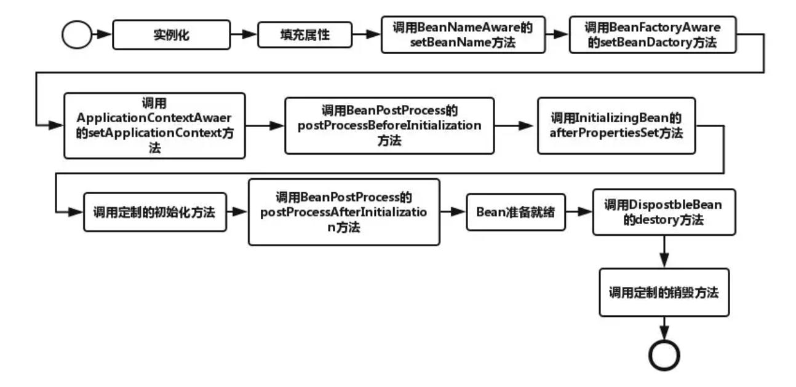

BeanFactoryPostProcessor和BeanPostProcessor，这两个接口，都是Spring初始化bean时对外暴露的扩展点。两个接口名称看起来很相似，但作用及使用场景却不同。
### 1、BeanFactoryPostProcessor接口
```java
public interface BeanFactoryPostProcessor {

    /**
     * Modify the application context's internal bean factory after its standard
     * initialization. All bean definitions will have been loaded, but no beans
     * will have been instantiated yet. This allows for overriding or adding
     * properties even to eager-initializing beans.
     * @param beanFactory the bean factory used by the application context
     * @throws org.springframework.beans.BeansException in case of errors
     */
    void postProcessBeanFactory(ConfigurableListableBeanFactory beanFactory) throws BeansException;
}
```
实现该接口，可以在spring的bean创建之前，修改bean的定义属性。也就是说，Spring允许BeanFactoryPostProcessor在容器实例化任何其它bean之前读取配置元数据，并可以根据需要进行修改，例如可以把bean的scope从singleton改为prototype，也可以把property的值给修改掉。可以同时配置多个BeanFactoryPostProcessor，并通过设置'order'属性来控制各个BeanFactoryPostProcessor的执行次序。

注意：BeanFactoryPostProcessor是在spring容器加载了bean的定义文件之后，在bean实例化之前执行的。

Spring中，有内置的一些BeanFactoryPostProcessor实现类，常用的有：
- org.springframework.beans.factory.config.PropertyPlaceholderConfigurer
- org.springframework.beans.factory.config.PropertyOverrideConfigurer

### 2、BeanPostProcessor接口
```java
public interface BeanPostProcessor {

    /**
     * Apply this BeanPostProcessor to the given new bean instance <i>before</i> any bean
     * initialization callbacks (like InitializingBean's <code>afterPropertiesSet</code>
     * or a custom init-method). The bean will already be populated with property values.
     * The returned bean instance may be a wrapper around the original.
     * @param bean the new bean instance
     * @param beanName the name of the bean
     * @return the bean instance to use, either the original or a wrapped one
     * @throws org.springframework.beans.BeansException in case of errors
     * @see org.springframework.beans.factory.InitializingBean#afterPropertiesSet
     */
    Object postProcessBeforeInitialization(Object bean, String beanName) throws BeansException;

    /**
     * Apply this BeanPostProcessor to the given new bean instance <i>after</i> any bean
     * initialization callbacks (like InitializingBean's <code>afterPropertiesSet</code>
     * or a custom init-method). The bean will already be populated with property values.
     * The returned bean instance may be a wrapper around the original.
     * <p>In case of a FactoryBean, this callback will be invoked for both the FactoryBean
     * instance and the objects created by the FactoryBean (as of Spring 2.0). The
     * post-processor can decide whether to apply to either the FactoryBean or created
     * objects or both through corresponding <code>bean instanceof FactoryBean</code> checks.
     * <p>This callback will also be invoked after a short-circuiting triggered by a
     * {@link InstantiationAwareBeanPostProcessor#postProcessBeforeInstantiation} method,
     * in contrast to all other BeanPostProcessor callbacks.
     * @param bean the new bean instance
     * @param beanName the name of the bean
     * @return the bean instance to use, either the original or a wrapped one
     * @throws org.springframework.beans.BeansException in case of errors
     * @see org.springframework.beans.factory.InitializingBean#afterPropertiesSet
     * @see org.springframework.beans.factory.FactoryBean
     */
    Object postProcessAfterInitialization(Object bean, String beanName) throws BeansException;

}
```


BeanPostProcessor，可以在Spring容器实例化bean之后，在执行bean的初始化方法前后，添加一些自己的处理逻辑。这里说的初始化方法，指的是下面两种：
- bean实现了InitializingBean接口，对应的方法为afterPropertiesSet
- 在bean定义的时候，通过init-method设置的方法

注意： BeanPostProcessor是在spring容器加载了bean的定义文件并且实例化bean之后执行的。 BeanPostProcessor的执行顺序是在BeanFactoryPostProcessor之后。

Spring中，有内置的一些BeanPostProcessor实现类，例如：
- org.springframework.context.annotation.CommonAnnotationBeanPostProcessor：支持@Resource注解的注入
- org.springframework.beans.factory.annotation.RequiredAnnotationBeanPostProcessor：支持@Required注解的注入
- org.springframework.beans.factory.annotation.AutowiredAnnotationBeanPostProcessor：支持@Autowired注解的注入
- org.springframework.orm.jpa.support.PersistenceAnnotationBeanPostProcessor：支持@PersistenceUnit和@PersistenceContext注解的注入
- org.springframework.context.support.ApplicationContextAwareProcessor：用来为bean注入ApplicationContext等容器对象


### 3、bean的生命周期


- 改图来源于网络：https://juejin.im/post/5ab1bf19f265da23771947f1


__Spring容器的Bean生命周期就经历了图中的生命周期，先分个类__:

1. InstantiationAwareBeanPostProcessor和BeanPostProcessor为容器级的生命周期接口,当Spring每加载任何一个Bean到容器中时，这些接口都会起到如图中的几次调用。这两个处理器叫做"容器级后处理器",他们的影响是全局的，能够影响所有的Bean.

2. BeanFactoryPostProcessor叫做"工厂级后处理器",类似的接口还有CustomEditorConfigurer,PropertyPlaceholderConfigurer等，这类接口只在上下文初始化的时候调用一次，其目的是完成一些配置文件的加工处理工作。

3. 剩下的就简单了，属于Bean级别的接口，专属于某个Bean所有，每个Bean实例化的时候调用自己特有的。

值得一提的是，无论是"容器级后处理器"还是"工厂级后处理器"，他们都是可以配置多个的(如，配置两个BeanPostProcessor)，如果想控制他们的调用顺序，实现一个org.springframework.core.Ordered接口即可。当然了，一般不用，一般一类后处理器只有一个即可。

### 附：文章参考
- [Spring BeanFactoryPostProcessor和BeanPostProcessor详解](https://github.com/TFdream/blog/wiki/Spring-BeanFactoryPostProcessor%E5%92%8CBeanPostProcessor%E8%AF%A6%E8%A7%A3)
